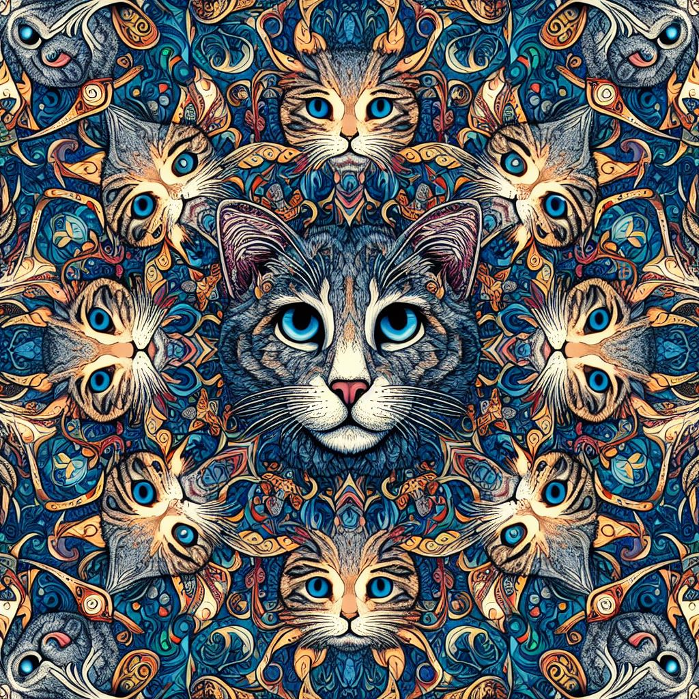

# BING Desktop Background Image Generator
 
This project is a Python script that scrapes images from Bing based on a given prompt and sets one of the images as a wallpaper.

  

## Installation

### Requirements

- Python 3.6+
- pip

### Steps

1. Clone the repository
2. Install the dependencies using `pip install -r requirements.txt`
3. Create a .env file in the root directory and add the following variables:
    - `MICROSOFT_EMAIL`: Your Microsoft email address
    - `MICROSOFT_PASSWORD`: Your Microsoft password
4. Run the script using `python main.py`

## Usage

By default, this program use a pre-defined prompt to apply a specific style to fit as an image for a desktop background.
To start, enter the rest of the prompt you want to use.
Then, just need to wait ! All the images will be downloaded in the `images` folder and a random one will be set as your desktop background.

- NOTE: Older images will be moved to the `save` folder, so you can keep them if you want.

### Examples

    
Some examples of generated images with various prompts

    
    
    
    

## TODO

- [ ] Add a GUI
- [ ] Image editing to fit better as a desktop background
- [ ] ...

## Contributing

Their still some improvements to do, so feel free to contribute to this project by opening an issue or a pull request 😊

## License

This project is licensed under the MIT License - see the [LICENSE](LICENSE) file for details.

